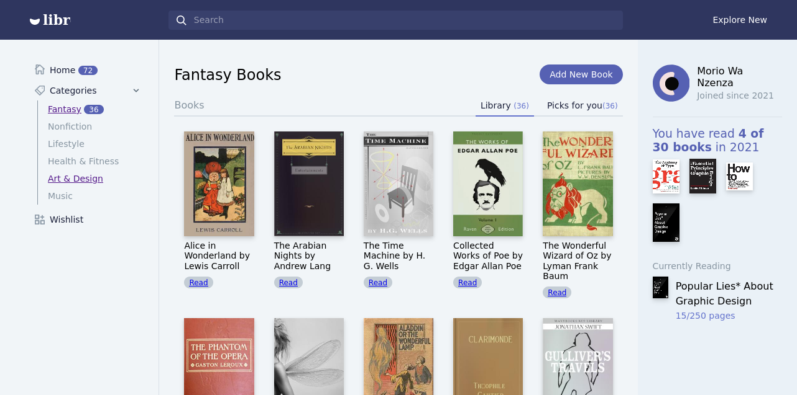

# Bookshelf
# Libre - a reponsive single page app template for collection management projects.



Libre is a responsive single page app template designed to filter data from web-applications as a mirror site to ease consumer reach of books. Built with tailwind.css and vanilla javascript of the front end, it incorporates python for task automation. Libre scrapes data on the backend from  the manybooks website gathering images, links and names for each iteration of a single book using python packages such as Beautiful Soup 4, requests and a html parser -> lxml parser.

## Running the project locally->Front-end manipulation
Make sure your local version is v6+. I currently we are using v10.8 as of March 2021.
```
npm install
```

If you want to regenerate css with your changes, run this command to generate css using tailwind config (e.g. tailwind.js)
```
$ ./node_modules/.bin/tailwind build style.css -c ./tailwind.js -o ./output.css
```

If you want to recompile the javascript, make sure browserify is installed globally then run this command to create bundle.js
```
$ npm install -g browserify
$ browserify main.js -o bundle.js
```
## Back-end manipulation
Make sure you have python3 and django installed and you are in a virtual environment. Linux users
```
$ virtualenv venv
```
```
$ source venv/bin/activate
```
Enter into the directory of the project(Bookshelf) and type
```
$ python3 manage.py runserver

```
It will prompt to install dependencies
```
$ pip install lxml

```
```
$ pip install bs4

```
```
$ pip install requests

```

## Live Demo
👋 [Libre Live Demo](http://librarie.co.ke)

## Credits
- [Browserify](http://browserify.org/)
- [Anime.js](http://animejs.com/)
- [tippy.js](https://atomiks.github.io/tippyjs/)
- [Tailwind.css](https://tailwindcss.com/)
- [Shopify Polaris's Icons](https://polaris.shopify.com/)
- [Manybooks](https://manybooks.net/)

## License
Use it freely but please do not republish, distribute or sell "as-is". [Read more about Us.]()


## Misc
Follow morehwachege:[Website](https://www.librarie.co.ke), [Linkedin](https://linkedin/in/morehwachege), [Twitter](https://twitter.com/morehwachege), [Facebook](https://facebook.com/morewachege)

Follow femar: [Website](https://www.omba.site/), [Dribbble](http://www.dribbble.com/fescii), [Github](https://github.com/fescii), [Twitter](https://twitter.com/femar_will), [Medium](https://medium.com/@)

[© aduki, Inc 2021](http://www.aduki.net)
[© Moreh Ca Chege]
[© Bookshelf 2021](http://www.librarie.co.ke)
